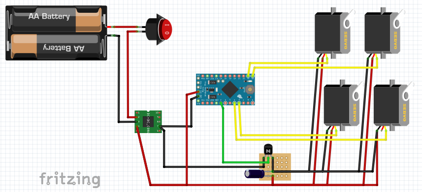
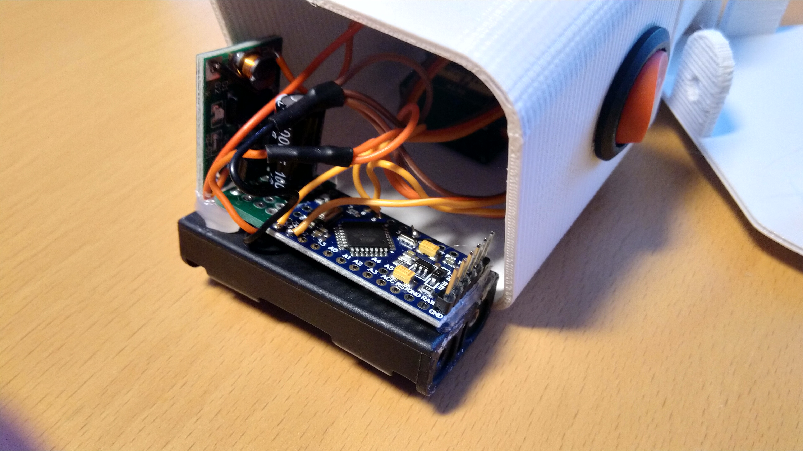
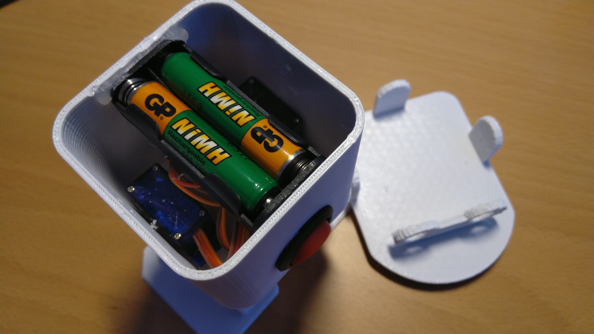
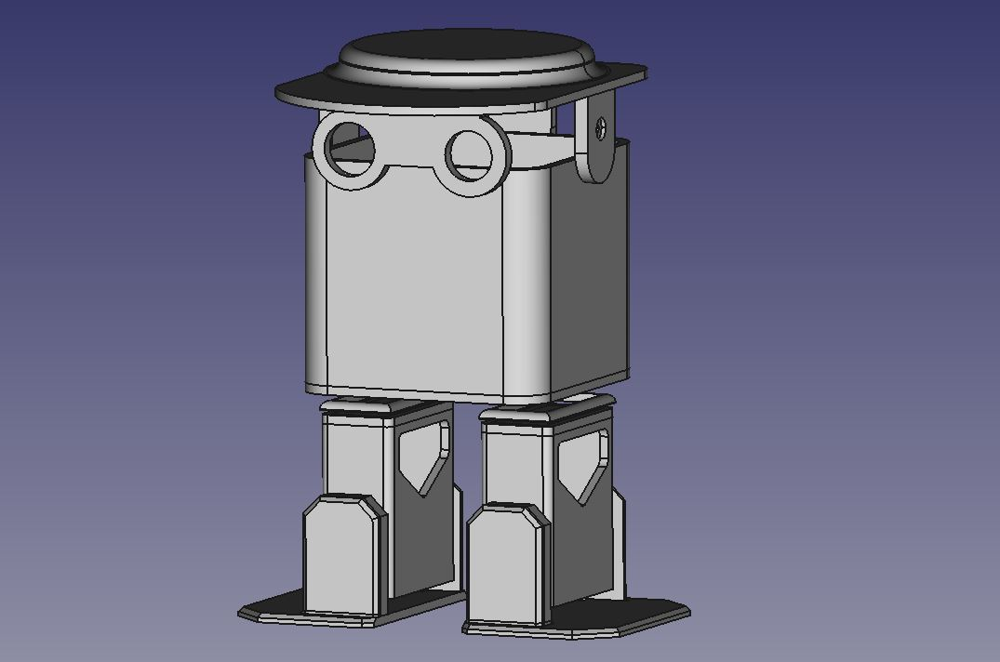

# Otto Yao (Yet Another One)

Another version of the "famous" Otto DIY dancing robot. Inspired by the existing movies on YouTube, but rebuild from scratch just because I liked doing it all myself. It runs on an Arduino Pro Mini board powered by two AAA batteries. 
This is not the best one around, so if you're looking for something better please do so!

##### YouTube:

#### Requirements:
* 1x Arduino Pro Mini ATMega 328p 5V
* 1x BC337 transistor
* 1x 100µF Capacitor *(*1)*
* 1x 1V-5V to 5V DC-DC Step-Up Power booster
* 4x Servo SG90 180 degrees
* 1x Power Switch
* 1x Battery case - 2slot AAA
* 1x Prototype PCB (not required, but very useful)
* Power cables (red&black)
* Programming board for the Arduino Pro Mini *(*2)*
* Soldering equipment
* 3D Printer
* Glue

**1: This value is just a guess, also tried a 1000µF wich worked fine, but drained the batteries in no-time*

**2: There are several solutions, like using another arduino with an USB interface like the R3 or Nano, or use an interface like the CP2102 wich I preferred (don't forget to also order your dupont cables)*

#### Electronics:

#### 3D models:
The STL's for printing the casing are available in the submap *models-3d*, where you also can find the source files (FCStd - FreeCad)

